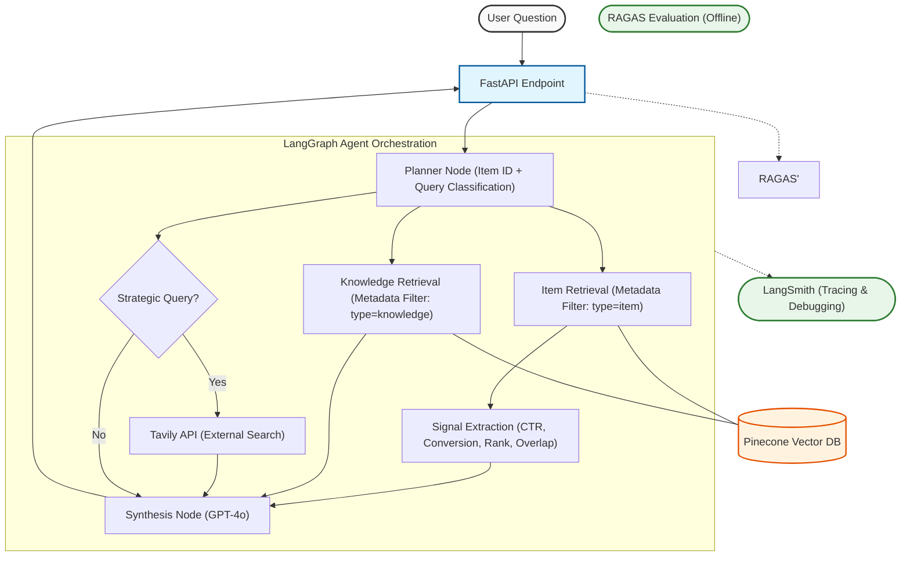

# 🏗️ System Architecture: Agentic RAG for Diagnostics

This architecture leverages **LangGraph v0.6.7** to orchestrate a deterministic diagnostic flow, utilizing metadata-filtered retrieval and conditional external search.

------------------------------------------------------------------------

# 🧩 1. Defining the Problem, Audience, and Scope

## 🧠 1-Sentence Problem Statement

Retail merchants lack a structured, data-driven way to diagnose why an
item is underperforming, forcing them to rely on manual analysis and
intuition instead of systematic decision intelligence.

------------------------------------------------------------------------

## 👤 Target Audience

**Primary Users:**\
Retail Category Merchants / Merchandising Managers responsible for
assortment optimization and revenue performance.

------------------------------------------------------------------------

## 📉 Why This Is a Real Problem

Retail merchants are accountable for driving category growth, optimizing
assortment mix, and improving item-level performance. However,
diagnosing underperformance is complex. An item with low sales could be
suffering from:

-   Poor discoverability
-   Weak intrinsic demand
-   Cannibalization from similar SKUs
-   Pricing issues
-   Structural weakness

Each root cause requires a different intervention.

Today, merchants rely on fragmented dashboards, spreadsheets, and ad hoc
analysis. This creates:

-   Time-consuming manual investigation
-   Inconsistent diagnostic logic across teams
-   Risk of misclassification (e.g., delisting an item that simply needs
    visibility)
-   Reactive rather than structured decision-making

A systematic AI-driven diagnostic layer reduces cognitive load,
standardizes logic, and enables faster, evidence-based interventions.

------------------------------------------------------------------------

## 🎯 Scope of This Application

This system focuses specifically on diagnosing item underperformance
using:

-   **Visibility signals** --- impressions, rank, CTR
-   **Demand signals** --- conversion rate, sales volume
-   **Cannibalization signals** --- similarity overlap score
-   **Strategic risk framing** --- via external search context

### ❌ Out of Scope

This system does *not*:

-   Forecast demand
-   Optimize pricing
-   Manage supply chain
-   Execute operational interventions

It is a **decision-support diagnostic layer**, not an execution engine.

------------------------------------------------------------------------

# 🧪 Evaluation Question Set (Input--Output Pairs)

These represent realistic merchant queries used to test the system.

------------------------------------------------------------------------

## 1️⃣ Discoverability Scenario

**Input:**\
\> Diagnose ITEM_014 and recommend the best action.

**Expected Diagnosis Category:**\
Discoverability

**Expected Primary Action:**\
Re-ranking or increased exposure

------------------------------------------------------------------------

## 2️⃣ Demand Weakness Scenario

**Input:**\
\> Why is ITEM_021 underperforming despite strong impressions?

**Expected Diagnosis Category:**\
Demand Weakness

**Expected Primary Action:**\
Content, pricing, or value repositioning

------------------------------------------------------------------------

## 3️⃣ Cannibalization Scenario

**Input:**\
\> Is ITEM_032 suffering from cannibalization?

**Expected Diagnosis Category:**\
Cannibalization

**Expected Primary Action:**\
Assortment rationalization

------------------------------------------------------------------------

## 4️⃣ Structural Weakness Scenario

**Input:**\
\> What is wrong with ITEM_001?

**Expected Diagnosis Category:**\
Structural Weakness

**Expected Primary Action:**\
Deeper review or potential delisting test

------------------------------------------------------------------------

## 5️⃣ Strategic Query (Agent Behavior Test)

**Input:**\
\> What long-term strategic risk does ITEM_001 pose to category
performance?

**Expected Agent Behavior:**

-   Tavily external search invocation
-   Strategic risk framing
-   Structured diagnostic output including business risk commentary

------------------------------------------------------------------------

# 🛠️ 2. Solution

## 💡 Proposed Solution (1–2 Paragraphs)

To address the diagnostic gap faced by retail merchants, this project implements an **Agentic Retrieval-Augmented Generation (RAG) system** that combines deterministic signal extraction with structured knowledge retrieval and controlled LLM synthesis.

The system uses LangGraph to orchestrate a multi-step reasoning workflow: first extracting quantitative performance signals, then retrieving relevant diagnostic knowledge from a vector database, optionally invoking external strategic context, and finally synthesizing a structured, evidence-based recommendation. This architecture ensures that diagnoses are grounded in item-level data while leveraging domain knowledge to standardize intervention logic. The result is a reproducible, explainable decision-support layer rather than an unconstrained conversational system.

------------------------------------------------------------------------

## 🏗️ Infrastructure Overview

The system architecture is illustrated in the Mermaid diagram above. It consists of the following components:

- **Next.js Frontend** — User interface for submitting diagnostic queries.
- **FastAPI Backend** — Serves as the API layer connecting frontend requests to the agent.
- **LangGraph Orchestrator** — Manages deterministic node execution and conditional routing.
- **Pinecone Vector Database** — Stores item narratives and intervention knowledge with metadata filtering.
- **OpenAI GPT-4o** — Performs structured reasoning and synthesis.
- **Cohere Rerank (Advanced Retrieval)** — Improves context selection quality.
- **Tavily API** — Provides optional external strategic context.
- **RAGAS (Offline Evaluation)** — Quantitatively evaluates faithfulness, relevance, and recall.

### Tooling Rationale (One Sentence Each)

- **LangGraph** — Chosen for explicit control over multi-step agent workflows.
- **Pinecone** — Enables scalable vector storage with metadata filtering for deterministic retrieval.
- **OpenAI Embeddings** — Provide semantic search capability for knowledge grounding.
- **Cohere Rerank** — Improves retrieval precision by reordering candidate chunks using cross-encoder scoring.
- **GPT-4o** — Balances reasoning quality and cost efficiency for structured synthesis.
- **FastAPI** — Lightweight, production-ready backend framework.
- **Next.js** — Simple, modern frontend framework for rapid deployment.
- **RAGAS** — Provides objective, repeatable evaluation of RAG performance.

------------------------------------------------------------------------

## 🔎 RAG vs Agent Components

### 📚 RAG Components

The Retrieval-Augmented Generation (RAG) layer consists of:

- Knowledge document embedding and indexing in Pinecone  
- Metadata-filtered similarity search  
- Cohere cross-encoder reranking  
- Context injection into the synthesis prompt  

This layer ensures that the model’s responses are grounded in retrieved evidence rather than parametric memory alone.

### 🤖 Agent Components

The agent layer consists of:

- Deterministic item ID extraction  
- Signal extraction from item narratives  
- Conditional routing (strategic vs operational query detection)  
- Optional Tavily external search invocation  
- Structured synthesis node execution  

Unlike a simple RAG pipeline, the agent enforces workflow control, ensuring reproducible reasoning steps before generation.

------------------------------------------------------------------------